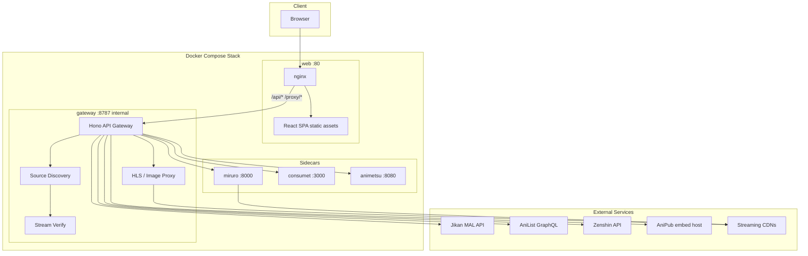
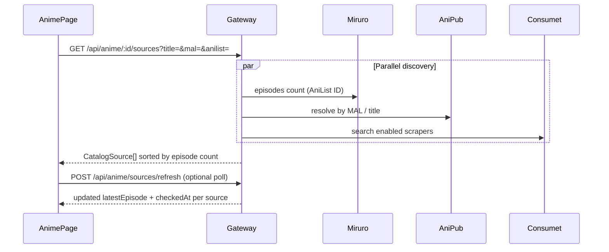
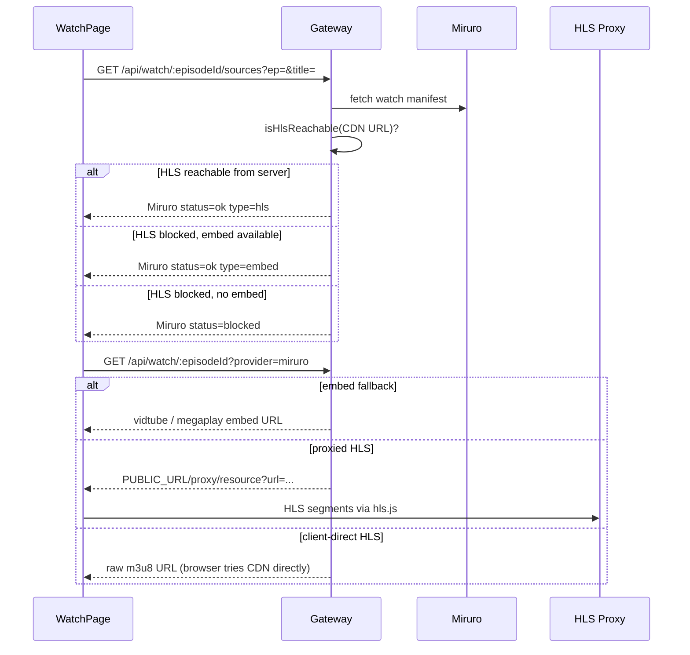

# AniStream

A self-hosted anime streaming platform that aggregates metadata, multi-host playback sources, and download links behind a single API gateway and a React web client. AniStream is designed to run as a Docker Compose stack on a workstation or a small VPS, with explicit handling for CDN blocking, provider outages, and catalog lag between hosts.

---

## Table of Contents

- [Overview](#overview)
- [System Design](#system-design)
- [Architecture](#architecture)
- [Data Flows](#data-flows)
- [Streaming Provider Model](#streaming-provider-model)
- [Gateway API](#gateway-api)
- [Frontend Application](#frontend-application)
- [Configuration](#configuration)
- [Quick Start](#quick-start)
- [Development Modes](#development-modes)
- [Production Deployment](#production-deployment)
- [Project Structure](#project-structure)
- [Technology Stack](#technology-stack)
- [Operations & Troubleshooting](#operations--troubleshooting)
- [Security Notes](#security-notes)

---

## Overview

AniStream separates concerns into three layers:

| Layer | Responsibility |
|-------|----------------|
| **Presentation** | React SPA served by nginx; routing, source picker, HLS/embed player, browse UX |
| **Orchestration** | Hono gateway: metadata fusion, source discovery, stream resolution, CORS/HLS proxies |
| **Providers** | Sidecar services and external APIs: Miruro (HLS), AniPub (embed), Consumet scrapers, Animetsu (downloads) |

The gateway is the single integration point. The web client never talks to Miruro, Consumet, or Animetsu directly. All streaming URLs that require special headers or bypass browser CORS are rewritten through gateway proxies using `PUBLIC_URL`.

**Primary design goals**

- **Resilience** — Multiple hosts per episode; user-visible source picker instead of silent fallback
- **Deployability** — One-command Docker stack; `restart: unless-stopped` on all services
- **Honest status** — Sources marked `ok`, `blocked`, or `unknown` based on server-side reachability probes
- **Rich catalog** — Jikan + AniList metadata, Zenshin episode enrichment, curated home rails

---

## System Design

### Component diagram



### Service responsibilities

| Service | Image / runtime | Port (host) | Role |
|---------|-----------------|-------------|------|
| **web** | nginx + Vite build | `80` | Serves SPA; reverse-proxies `/api/` and `/proxy/` to gateway |
| **gateway** | Node 20, Hono | internal `8787` | Unified REST API, provider orchestration, proxies |
| **miruro** | Python, Miruro-API | `8000` | Primary HLS catalog and stream resolution (AniList IDs) |
| **consumet** | Node 20, `@consumet/extensions` | `3000` | Optional Consumet-compatible scraper sidecar |
| **animetsu** | Go | `8080` | Download search and optional watch endpoints |

All Compose services use `restart: unless-stopped` so they recover after Docker Desktop or host reboot (when Docker is configured to start on login).

### nginx routing

The web container terminates HTTP on port 80 and forwards API traffic to the gateway:

```
/              → SPA (try_files → index.html)
/api/*         → gateway:8787/api/*
/proxy/*       → gateway:8787/proxy/*
/health        → gateway:8787/health
```

In production Docker builds, `VITE_API_URL` is empty so the browser uses same-origin requests (`/api/...`), which nginx routes correctly.

---

## Architecture

### Logical layers

```
┌─────────────────────────────────────────────────────────────┐
│  UI Layer                                                    │
│  Home · Browse · Search · Anime Detail · Watch               │
│  SourcePicker · EpisodeList · VideoPlayer · ContinueWatching │
└────────────────────────────┬────────────────────────────────┘
                             │ REST + proxied media
┌────────────────────────────▼────────────────────────────────┐
│  Gateway Layer                                               │
│  Metadata · Discovery · Watch resolution · Health probes       │
│  proxy/image · proxy/resource (HLS rewrite)                  │
└─────┬──────────┬──────────┬──────────┬──────────────────────┘
      │          │          │          │
   Miruro     AniPub    Consumet    Animetsu
   (HLS)      (embed)   (scrapers)  (downloads)
      │          │          │
   Jikan · AniList · Zenshin (metadata only)
```

### Metadata pipeline

Metadata is assembled from multiple upstreams with clear fallbacks:

1. **Jikan** — MAL search, season lists, relations, scores
2. **AniList** — Curated browse rails, spotlight, poster art, ID crosswalk (`mal` ↔ `anilist`)
3. **Zenshin** — Episode-level enrichment (air dates, descriptions, planned episode counts, non-streamable catalog entries)

Episode responses from Miruro or AniPub can be merged with Zenshin so the UI shows full series context even when a host only has partial uploads.

---

## Data Flows

### Catalog source discovery

When a user opens an anime detail page, the gateway discovers **which hosts have the series** and how many episodes each reports:



Each catalog source includes `episodes`, `latestEpisode`, `checkedAt`, and `type` (`hls` | `embed`). The UI shows per-source “last updated” badges and a manual **Check for new episodes** action for airing shows.

### Watch source discovery and playback

Per-episode discovery runs **reachability probes** before playback:



**Miruro playback resolution** (`resolveMiruroPlayback`) tries, in order:

1. Server-reachable HLS → proxied through `proxy/resource`
2. Embed players (vidtube, megaplay) when CDN blocks the server IP
3. Direct HLS URL for client-side playback as a last resort

This matters on VPS/datacenter IPs: the gateway may be blocked while the user's home browser is not, and embed players often work when raw HLS does not.

### HLS proxy

`GET /proxy/resource` fetches upstream manifests and segments with the correct `Referer` and `User-Agent`, then:

- Rewrites every URI in `.m3u8` playlists to loop back through the proxy
- Passes through VTT subtitles with CORS headers
- Returns `502` when upstream CDNs block the gateway (triggering UI fallback messaging)

### Image proxy

AniList and other CDNs do not send `Access-Control-Allow-Origin` for browser requests from `localhost`. The gateway exposes `GET /proxy/image?url=` and rewrites poster fields in API responses to point through `PUBLIC_URL/proxy/image`, avoiding CORS failures on `<video>` posters and catalog cards.

---

## Streaming Provider Model

### Primary providers (always enabled)

| Provider | Type | Strengths | Limitations |
|----------|------|-----------|-------------|
| **Miruro** | HLS (+ embed fallback) | Fast uploads, soft subs, intro/outro metadata | HLS CDNs often block datacenter/VPS IPs |
| **AniPub** | iframe embed | Reliable on servers; fewer CDN blocks | Upload lag vs scrapers; fewer episodes early in a season |

`STREAM_PREFER_EMBED=true` (recommended on VPS) tries AniPub first in unified search.

### Consumet scrapers (optional)

Consumet runs **in-process** in the gateway (`@consumet/extensions`) with an optional Docker sidecar at `CONSUMET_URL`. The adapter prefers the sidecar when healthy, otherwise falls back to in-process scrapers.

| Scraper | Default | Notes |
|---------|---------|-------|
| AnimePahe | **Off** | Set `ENABLE_ANIMEPAHE=true`; Cloudflare often still blocks |
| HiAnime | **Off** | Discontinued (410) |
| AnimeKai | **Off** | Domain/infrastructure dead |
| KickAssAnime | **Off** | Stale API paths |

Runtime config: `gateway/src/provider-config.ts`. Reference mirror list: `gateway/providers.json`.

### Provider health

`GET /api/providers/status` probes Miruro reachability, AniPub availability, and each enabled Consumet scraper. Response includes `consumetMode: "remote" | "local"` for the active Consumet backend.

---

## Gateway API

Base URL: `http://localhost/api` (Docker) or `http://localhost:8787/api` (Vite dev proxy).

### Health & operations

| Method | Path | Description |
|--------|------|-------------|
| `GET` | `/health` | Gateway liveness |
| `GET` | `/api/providers/status` | Provider probe results |

### Browse & metadata

| Method | Path | Description |
|--------|------|-------------|
| `GET` | `/api/browse/curated` | AniList home rails (spotlight, trending, genre) |
| `GET` | `/api/browse/section/:section` | Section grids (`trending`, `popular`, `recent`, `upcoming`, `season`, `top`, `genre`) |
| `GET` | `/api/browse/home` | Season + top combined |
| `GET` | `/api/metadata/search?q=` | MAL search |
| `GET` | `/api/metadata/:malId` | Anime detail |
| `GET` | `/api/metadata/:malId/relations` | Franchise / season relations |
| `GET` | `/api/zenshin/mappings` | Episode catalog mappings (`mal_id` or `anilist_id`) |

### Streaming

| Method | Path | Description |
|--------|------|-------------|
| `GET` | `/api/anime/search?q=` | Multi-provider title search |
| `GET` | `/api/anime/:id?provider=` | Provider-specific anime info |
| `GET` | `/api/anime/:id/episodes` | Episode list (+ Zenshin enrichment) |
| `GET` | `/api/anime/:id/sources` | Catalog-level source discovery |
| `POST` | `/api/anime/sources/refresh` | Refresh episode counts / `latestEpisode` |
| `GET` | `/api/watch/:episodeId/sources` | Per-episode playable sources |
| `GET` | `/api/watch/:episodeId?provider=` | Resolved stream (HLS proxy, embed, or direct) |

### Downloads (Animetsu)

| Method | Path | Description |
|--------|------|-------------|
| `GET` | `/api/downloads/search?q=` | Search download catalog |
| `GET` | `/api/downloads/:id/:ep` | DDL / torrent links |

### Proxies

| Method | Path | Description |
|--------|------|-------------|
| `GET` | `/proxy/image?url=` | Image CORS bypass |
| `GET` | `/proxy/resource?url=&referer=&ua=` | HLS manifest/segment proxy |

---

## Frontend Application

**Stack:** React 18, React Router 6, Vite 6, TypeScript 5.7, Tailwind CSS 3.4, hls.js 1.5

| Route | Page | Features |
|-------|------|----------|
| `/` | Home | Curated rails, hero spotlight, continue watching, genre chips |
| `/browse/:section` | Browse | Full-width catalog grids with pagination |
| `/search` | Search | MAL metadata + stream provider results |
| `/anime/:id` | Anime detail | Poster, stats, **source picker**, episode grid/list, downloads |
| `/watch/:animeId/:episodeId` | Watch | **Source picker**, HLS/embed player, subtitle tracks, progress save |

### Notable UX systems

- **Source picker** — User chooses host explicitly; shows `ok` / `blocked` / embed vs HLS; no silent failover
- **Episode list** — Grid (12/page) or compact list (8/page) with range chips; Zenshin air dates and descriptions
- **Continue watching** — `localStorage` resume queue (max 12 entries) on the home page
- **Stream player** — hls.js for proxied HLS; iframe sandbox for embeds; VTT subtitle parsing; direct-URL fallback when proxy fails

---

## Configuration

Copy `.env.example` to `.env` in the project root. Docker Compose loads this file automatically.

| Variable | Docker default | Purpose |
|----------|----------------|---------|
| `PUBLIC_URL` | `http://localhost` | Base URL embedded in proxy links returned to the client |
| `CORS_ORIGIN` | `*` | Gateway CORS allowlist |
| `MIRURO_URL` | `http://miruro:8000` (Compose) | Miruro sidecar base URL |
| `MIRURO_API_KEY` | `anistream-local-miruro-key` | Miruro `x-api-key` header |
| `CONSUMET_URL` | `http://consumet:3000` | Consumet sidecar; gateway falls back to in-process if unreachable |
| `ANIMETSU_URL` | `http://animetsu:8080` | Animetsu downloads API |
| `ANIPUB_URL` | `https://anipub.xyz` | AniPub embed host |
| `STREAM_PREFER_EMBED` | `true` | Prefer AniPub in unified search (recommended on VPS) |
| `ENABLE_ANIMEPAHE` | `false` | Opt-in AnimePahe scraper |
| `ZENSHIN_URL` | Render-hosted API | Episode enrichment primary |
| `ZENSHIN_URL_FALLBACK` | Render fallback | Enrichment failover |

**Important:** `PUBLIC_URL` must match how users reach the gateway:

- Docker all-in-one (`http://localhost`) → `PUBLIC_URL=http://localhost`
- Vite dev (`http://localhost:5173` → proxy `8787`) → `PUBLIC_URL=http://localhost:8787`

---

## Quick Start

### Prerequisites

- [Docker Desktop](https://www.docker.com/products/docker-desktop/) (Windows, macOS, or Linux)
- 4 GB+ RAM recommended for first build

### One-command start

**Option A — double-click**

```
Start-AniStream.bat
```

**Option B — terminal**

```bash
npm start
# equivalent: docker compose up -d --build
```

Open **http://localhost**

### Stop

```bash
npm run stop
# or double-click Stop-AniStream.bat
```

### Auto-start on Windows login

1. Open **Task Scheduler** → Create Task
2. Trigger: **At log on**
3. Action: `C:\path\to\anistream\Start-AniStream.bat`
4. Start in: `C:\path\to\anistream`
5. Enable **Start Docker Desktop when you sign in** (Docker Desktop → Settings → General)

---

## Development Modes

### Mode A — Docker all-in-one (recommended for daily use)

No separate terminals. Full stack on port 80.

```bash
npm start
```

### Mode B — Vite hot reload (UI development)

Run sidecars in Docker; gateway and web locally for fast refresh.

```bash
# Terminal 1 — sidecars only
docker compose up -d miruro consumet animetsu

# Terminal 2 — gateway
cd gateway && npm run dev

# Terminal 3 — web
cd web && npm run dev
```

Set in `.env`:

```
PUBLIC_URL=http://localhost:8787
```

Open **http://localhost:5173** (Vite proxies `/api` and `/proxy` to `:8787`).

### Useful commands

| Command | Action |
|---------|--------|
| `npm run logs` | Tail all container logs |
| `npm run status` | `docker compose ps` |
| `npm run restart` | Restart containers |

---

## Production Deployment

### AWS Lightsail (scripted)

```powershell
.\deploy\aws-lightsail.ps1
```

The script provisions an Ubuntu 22.04 instance, opens ports 80/22, uploads the project, and runs `deploy/server-setup.sh`, which:

1. Installs Docker and Compose v2
2. Writes `.env` with `PUBLIC_URL=http://<public-ip>` and `STREAM_PREFER_EMBED=true`
3. Runs `docker compose up -d --build`

Access the app at `http://<public-ip>`.

**Production guidance**

- Prefer **AniPub embed** on VPS (`STREAM_PREFER_EMBED=true`) — datacenter IPs are frequently blocked by HLS CDNs
- Miruro remains valuable for episode discovery and embed fallbacks when HLS is blocked server-side
- Set `CORS_ORIGIN` to your domain in production if exposing the API directly

---

## Project Structure

```
anistream/
├── docker-compose.yml       # Five-service stack definition
├── package.json             # npm start / stop / logs
├── .env.example             # Environment reference
├── Start-AniStream.bat      # Windows one-click launcher
├── scripts/
│   ├── start.ps1
│   └── stop.ps1
├── gateway/                 # Hono API gateway (TypeScript)
│   ├── src/
│   │   ├── index.ts         # Route definitions
│   │   ├── source-discovery.ts
│   │   ├── provider-config.ts
│   │   ├── proxy.ts         # HLS + image proxy
│   │   ├── stream-verify.ts # CDN reachability probes
│   │   └── services/        # miruro, anipub, consumet, animetsu, jikan, anilist, zenshin
│   └── Dockerfile
├── web/                     # React SPA + nginx
│   ├── src/pages/           # Home, Browse, Search, Anime, Watch
│   ├── src/components/      # SourcePicker, VideoPlayer, EpisodeList, …
│   ├── nginx.conf
│   └── Dockerfile
├── services/
│   ├── miruro/              # Miruro-API sidecar (Python)
│   ├── consumet/            # @consumet/extensions HTTP shim (Node)
│   └── animetsu-src/        # Animetsu Go API
└── deploy/
    ├── aws-lightsail.ps1
    └── server-setup.sh
```

---

## Technology Stack

| Component | Technologies |
|-----------|--------------|
| **Frontend** | React 18.3, React Router 6.28, Vite 6, Tailwind 3.4, hls.js 1.5, TypeScript 5.7 |
| **Gateway** | Hono 4.6, Node 20, `@consumet/extensions` 1.8, TypeScript 5.7 |
| **Miruro sidecar** | Python 3.11, FastAPI, [Miruro-API](https://github.com/walterwhite-69/Miruro-API) |
| **Consumet sidecar** | Node 20, Hono, `@consumet/extensions` |
| **Animetsu sidecar** | Go 1.22 |
| **Reverse proxy** | nginx (Alpine) |
| **Containers** | Docker Compose v2 |

---

## Operations & Troubleshooting

| Symptom | Likely cause | Action |
|---------|--------------|--------|
| Miruro shows **Blocked on server** | HLS CDN blocks gateway/Docker IP | Switch to **AniPub** embed or wait for embed fallback; expected on VPS |
| Only one source for new episode | AniPub upload lag vs Miruro | Normal for airing shows; check `latestEpisode` badges |
| `502` on `/proxy/resource` | Upstream CDN block | Use embed source; gateway auto-falls back when possible |
| AniList poster CORS errors | Direct CDN hit from browser | Ensure gateway is rebuilt; posters should use `/proxy/image` |
| Downloads search empty | Animetsu container not running | `docker compose up -d animetsu` |
| `http://localhost` blank | Web container not ready | `npm run logs`; wait for gateway health |
| Port 80 in use | Another service on 80 | Stop IIS/sk conflicting service or change Compose web port mapping |

Check provider health:

```bash
curl http://localhost/api/providers/status
```

---

## Security Notes

- **Do not commit** `.env`, `*.pem`, or API keys. `.gitignore` should exclude secrets.
- Miruro requires `MIRURO_API_KEY`; rotate defaults before any public deployment.
- Embed players load third-party iframes; sandbox attributes limit capability but content is external.
- Scraping providers may violate upstream terms of service; use self-hosted infrastructure responsibly.
- The HLS proxy fetches arbitrary URLs when called directly; keep the gateway off the public internet without authentication if untrusted users can reach it.

---

## License

Private / personal use. Third-party services (Miruro, AniPub, Jikan, AniList, Zenshin, Consumet scrapers) are subject to their own terms and availability.
